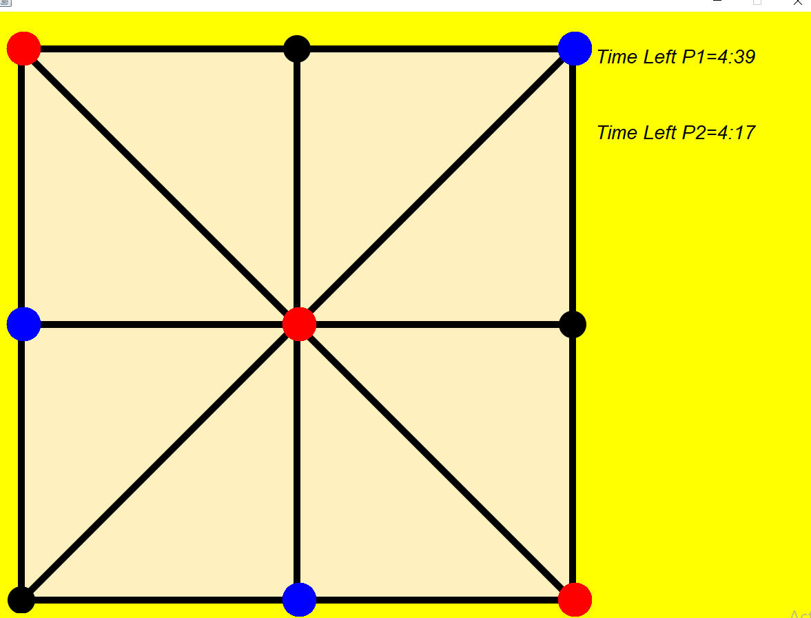

# Three-Beads-Game

This is a Java program that implements a two-player board game. The game board consists of three beads for each player. The players take turns to move their beads by clicking on the bead and moving the bead using keyboard. The goal of the game is to get all three of your beads in a straight line on the board before your opponent does. The game includes two timers, one for each player, and the game also ends when one of the players' timers reaches zero.(Like Blitz Chess Game).

## How to Play?
-> First click on the bead
-> Move the bead using keyboard buttons
   - To move up, press the arrow up key.
   - To move down, press the arrow down key.
   - To move right, press the arrow right key.
   - To move left, press the arrow left key.
   - To move upright, press the "I" button.
   - To move upleft, press the "Y" button.
   - To move downright, press the "M" button.
   - To move downleft, press the "B" button on the keyboard.
## Screenshots
Initial Game board

The First player(Red color) moves the rightmost bead down.

The Second player(Blue color) moves the middle bead up.

The First player moves the middle bead to the right.

This way the player takes turns to get all the three beads in a straight line before their opponent.

Here the first player(Red) is the winner as his beads are in straight line position.

